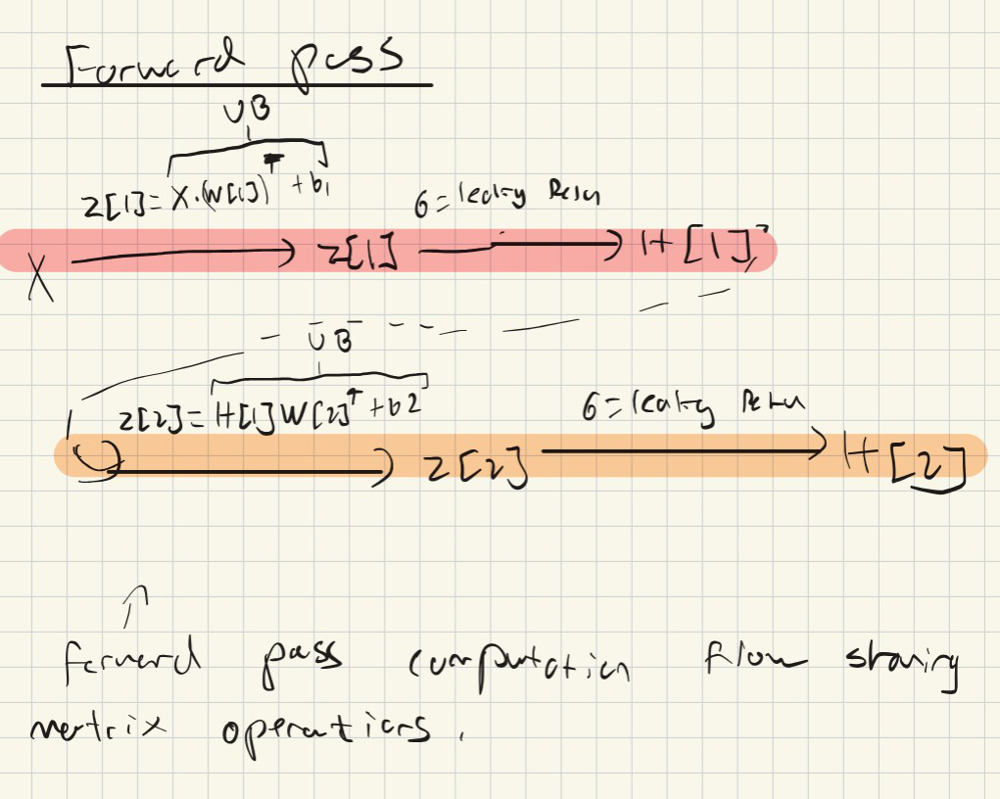
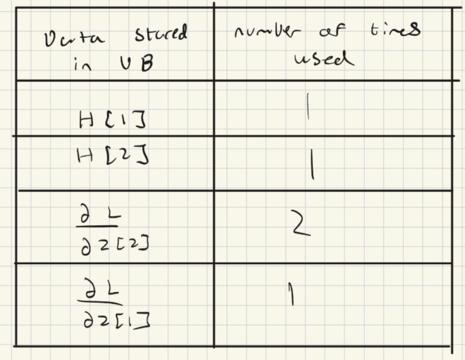
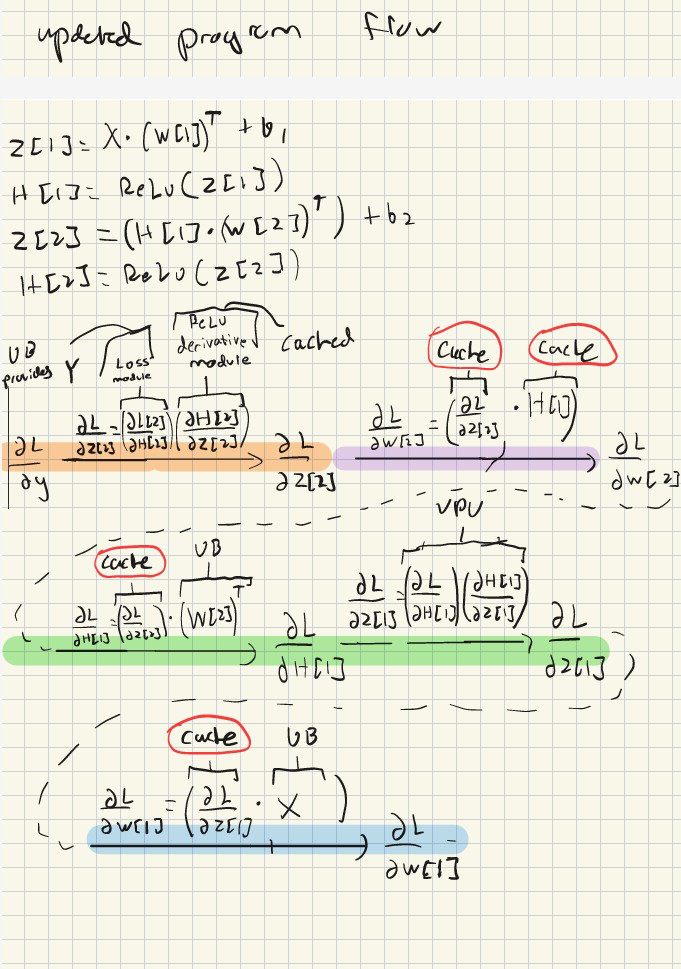
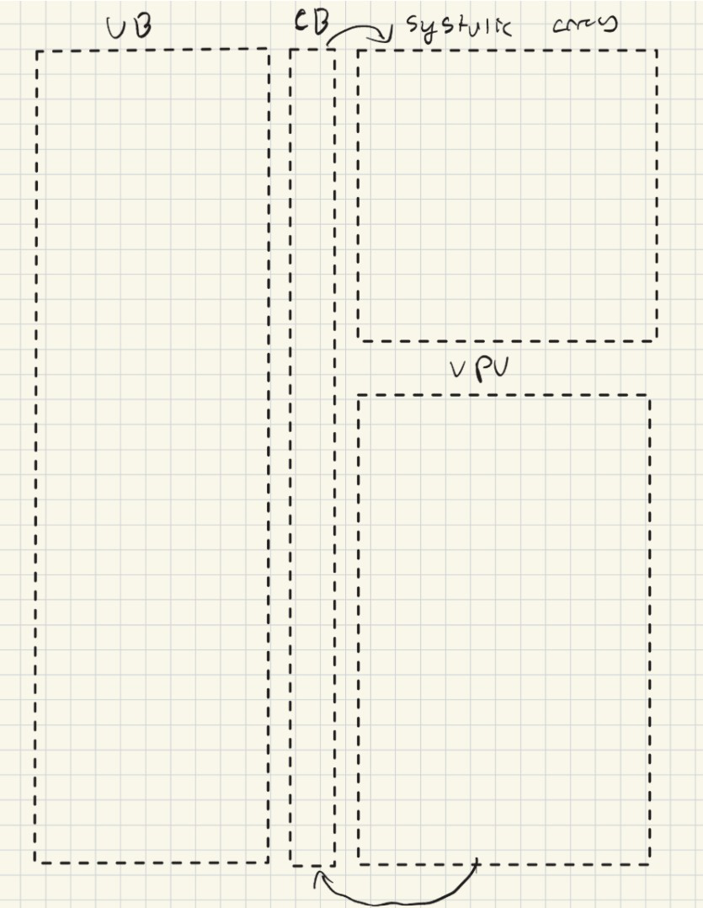

## Table of Contents
- [Optimizing Data Movement through a Tensor Processing Unit Overview](#optimizing-data-flow-through-a-tensor-processing-unit-overview)
- [Legend](#legend)
- [Forward Pass](#forward-pass)
- [Backward Pass for Approach 1](#backward-pass-for-approach-1)
- [Backward Pass for Approach 2](#backward-pass-for-approach-2)
- [Potential Hardware Implementation](#potential-hardware-implementation)


## Optimizing data flow through a Tensor Processing Unit Overview


This analysis and optimization is inspired by the (TinyTPU)[https://www.tinytpu.com/], from which the hardware implementation of this Tensor Processing Unit (TPU) is also adapted. The example used here focuses on applying this TPU to solve the XOR problem using a simple 2→2→1 multilayer perceptron (MLP).

To make predictions with our neural network, we perform matrix multiplications that combine the input vectors (X) with the corresponding weights in the network, a process known as the forward pass.

In addition, to improve the network’s performance over time, we need to update these weights based on how accurate the predictions are. This requires a loss function that measures the difference between the predicted outputs and the true values. Once the loss is computed, we calculate the partial derivative of the loss with respect to each weight to determine how the weights should be adjusted, this is the backward pass or gradient computation phase.

For this particular example, we use the ReLU (Rectified Linear Unit) activation function. During the forward pass, the operations done can be expressed as:

```
Z = [X ⋅ W] + b
H = ReLu(Z)
```
where X represents the input matrix, W the weights, b the bias vector, and H the resulting output activations. 

During the backward pass, the process becomes more complex, as we need to compute several intermediate partial derivatives and combine them to obtain the partial derivatives of the loss with respect to each individual weight. The specific quantities/terms that must be calculated to reach this point are shown in the diagram below:

<p align="center">
  
</p>

<p align="center"><sub>calculating derivatives for backward pass</sub></p>

In the above diagram, regard the green as the first step and yellow as they second step. There are two approaches we can take. The first approach, which is shown on top, is first calculating all our dl/dz's and then calculating each respective dl/dw. The second approach is calculating an individual dl/dw right after calculating its respective dl/dz. I wanted to investigate which is more efficient to implement in hardware.

### Legend

<p align="center">
  
</p>

<p align="center"><sub>legend for forward and backward pass</sub></p>

## Forward Pass

The forward pass is unchanged between both approaches so the flow to do the matrix multiplications remain the same. This flow is shown in the diagram below.

<p align="center">
  
</p>

<p align="center"><sub>Forward pass</sub></p>


## Backward Pass for Approach 1

The flow for the backward pass with approach 1 where we calculate all the dl/dz's and then calculating each respective dl/dw is shown below:


<p align="center">
  
</p>

<p align="center"><sub>Backward pass Approach 1</sub></p>

Some notes about this:

- In the current flow, the Unified Buffer(UB) or memory is called 6 times (2 times in forward pass, 4 times in backward pass (one of these is just to supply Y to loss module)). We also note that in the current hardware implementation, H[2] is not stored in memory and is instead cached because it is only used once right after. It might be possible to cache other data instead of going to memory so lets check how many times everything is used:


<p align="center">
  
</p>

<p align="center"><sub>Unified Buffer calculated data count table</sub></p>


We see that H[1], H[2], and dl/dz[1] are all only used one time. So then why is only H[2] currently cached?
Well if we look at pass 2, we see that H[2] is only used once but only used by the Vector Processing Unit (VPU). On the other hand, while H[1] and dl/dz[1] are also only used once, they are used by the systolic array. Can we still optimize this? 

Why dont we try to cache dl/dz[1] since its only used once and right after? The only issue with doing this right now is that H[2] was easy to cache since the computation that followed it could be directly done by the VPU. Here if we cache dl/dz[1] we would have to make it go to the systolic array right after. However, implementing this functionality of a direct pass from the systolic array to the VPU could let us cache other data. If we look at where data is generated and then used we see this:


<p align="center">
  
</p>

<p align="center"><sub>Where data is generated and then used in the backward pass</sub></p>

## Backward Pass for Approach 2

Now lets optimize this by reoganizing the passes so that data generated is instantly produced after, or in other words, approach 2 where we calculate an individual dl/dw right after calculating its respective dl/dz. This second  data flow is shown in the diagram below:


<p align="center">
  
</p>

<p align="center"><sub>Data flow for approach 2</sub></p>


Pass 5 is now moved to before pass 3 and 4 (purple moved to before green and blue), so that now dl/dz[2] is used immediately after its generated. Basically, instead of calculating all dl/dzn and then all dl/dwn, we calculate each dl/dwn right after its respective dl/dzn.

Note: H[1] might not be cached since its generated much earlier, would have to decide based on implementation

We also see that now the two matrix multiplications that follow the calculation of dl/dz[2] are completely independent of each other. This means we could do them in parallel if systolic array supports this.

## Potential Hardware Implementation

As to how the second approach could be implemented in the hardware of the tensor processing unit. One approach could be a second buffer ("cache buffer"), that just facilitates faster data transfer directly from the vector processing unit to the systolic array:

<p align="center">
  
</p>

<p align="center"><sub>Potential new architecture</sub></p>